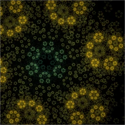

# :art: A Fractal A Day

<a href="https://twitter.com/AFractalADay/status/962651103325310976" target="_blank"></a>

[](https://github.com/surt91/AFractalADay/actions/workflows/rust.yml)

This is the Twitter bot [@AFractalADay](https://twitter.com/AFractalADay),
which tweets pictures of random fractals.

Two blog articles describing the fractals and -- more importantly -- showing example fractals
can be found [here](https://blog.schawe.me/randomFractals.html) and [here](https://blog.schawe.me/more-fractals.html).

## :hammer_and_wrench: Setup

This program is pure rust with an optional dependency on `Imagemagick` and `optipng`
which will be called through the shell.

Just use cargo: `cargo run --release --features="binaries"`

**Important:** Do not forget to put in valid keys and secrets in `keys_and_secrets.json`.

## :whale: Docker

You can also use a docker container:

```bash
# build it
docker build . -t fractal
# run it
mkdir -p img
docker run -v $PWD/img:/img fractal --appolonian --width 400 --height 400
# the generated fractal will be saved to the mounted volume (here `./img`)
```

## :herb: Dependencies

* Imagemagick (optional)
* optipng (optional)
